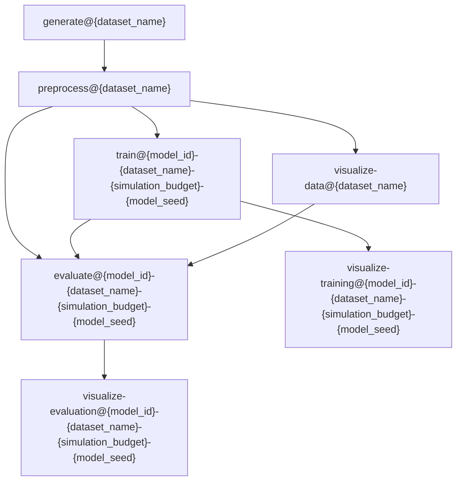
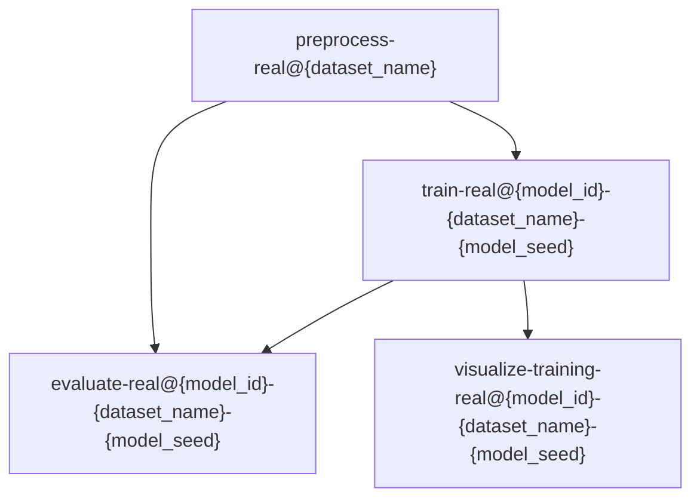

# The official implementation of: "Kolmogorov–Smirnov GAN"

by Maciej Falkiewicz and Naoya Takeishi and Alexandros Kalousis

The arXiv preprint can be found under [this link](https://arxiv.org/abs/2406.19948).

## Project structure

### The experimental pipeline

The project is governed with [Data Version Control (DVC)](https://dvc.org/) with the pipeline defined in [`dvc.yaml`](dvc.yaml) and parameterized with a global config file: [`experiments/configs/global.yaml`](experiments/configs/global.yaml). There are two types of datasets: *synthetic datasets* and *real-world datasets* which have independent pipelines, both defined in [`dvc.yaml`](dvc.yaml).

#### Synthetic datasets pipeline

The possible values of the variables are:
- `{model_id}`: "model1" (GAN), "model2" (WGAN), "model3" (KSGAN) 
- `{dataset_name}`: "swissroll", "circles", "rings", "moons", "8gaussians", "pinwheel", "2spirals", "checkerboard"
- `{simulation_budget}`: "512", "1024", "2048", "16384", "65536"
- `{model_seed}`: "0", "1", "2", "3", "4"

#### Real-world datasets pipeline

The possible values of the variables are:
- `{model_id}`: "model1" (GAN), "model2" (WGAN), "model3" (KSGAN) 
- `{dataset_name}`: "mnist", "cifar10"
- `{model_seed}`: "0", "1", "2", "3", "4"

### Execution on a [slurm](https://slurm.schedmd.com/overview.html) orchestrated cluster

- To execute the synthetic datasets pipeline you can use [`experiments/scripts/pipeline.py`](experiments/scripts/pipeline.py) script
- To execute the real-world datasets pipeline you can use [`experiments/scripts/pipeline-real.py`](experiments/scripts/pipeline-real.py) script
  
  - The `evaluate-real@{model_id}-{dataset_name}-{model_seed}` stage is not triggerred by the script

Attention: the scripts assume that `preprocess@{dataset_name}` (`preprocess-real@{dataset_name}`) stages have been already executed!

Please mind that this way of execution bypasses DVC, and thus requires [commiting](https://dvc.org/doc/command-reference/commit) the changes in order to control versions.

In `CPU_PARTITIONS` and `GPU_PARTITIONS` environmental variables you should specify the available CPU and GPU partitions.

### Source code

- Implementations of the synthetic datasets simulators: [`src/simulators/`](src/simulators)
- Implementations of the generative models:
 
  - GAN: [`src/models/gan.py`](src/models/gan.py)
  - Wasserstein GAN: [`src/models/wgan.py`](src/models/wgan.py)
  - Kolmogorov–Smirnov GAN: [`src/models/ksgan.py`](src/models/ksgan.py) (the proposed method)
- Scripts used to run the experiments: [`experiments/scripts`](experiments/scripts)
- Training utilities: [`src/training/utils.py`](src/training/utils.py)
- Evaluation utilities: [`src/evaluation/utils.py`](src/evaluation/utils.py)

## Environment

All the python dependencies are listed in [`requirements.txt`](requirements.txt) file.

## Data

The DVC cache for the project can be downloaded from [here](https://hessoit-my.sharepoint.com/:u:/g/personal/maciej_falkiewi_hes-so_ch/Eb9L_CSaWFBOkUA-1qyTFrIB7RkbEBCN3uaXzSSorTW04A?e=y4wLyd).

